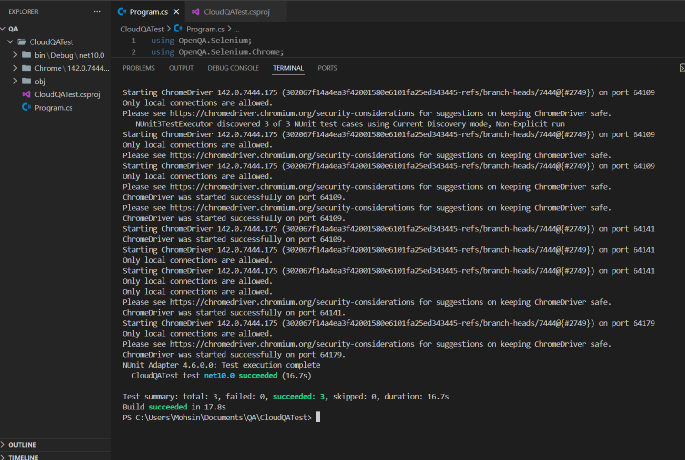

# CloudQA Automation Test Solution

## Overview
Automated tests for three fields on the CloudQA Practice Form using C# and Selenium with resilient locator strategies.

## Tests Implemented
1. **First Name Field** - Text input validation
2. **Email Field** - Email format validation
3. **Gender Radio Button** - Radio button selection

## Setup Instructions
1. Install .NET 10.0 SDK
2. Run: `dotnet restore`
3. Run: `dotnet build`
4. Run: `dotnet test`

## Key Features
- Multiple fallback locator strategies per element
- Explicit waits for dynamic content
- NUnit 4.x testing framework
- Resilient to HTML attribute and position changes

## Test Results
All 3 tests passed successfully in 16.7 seconds.

